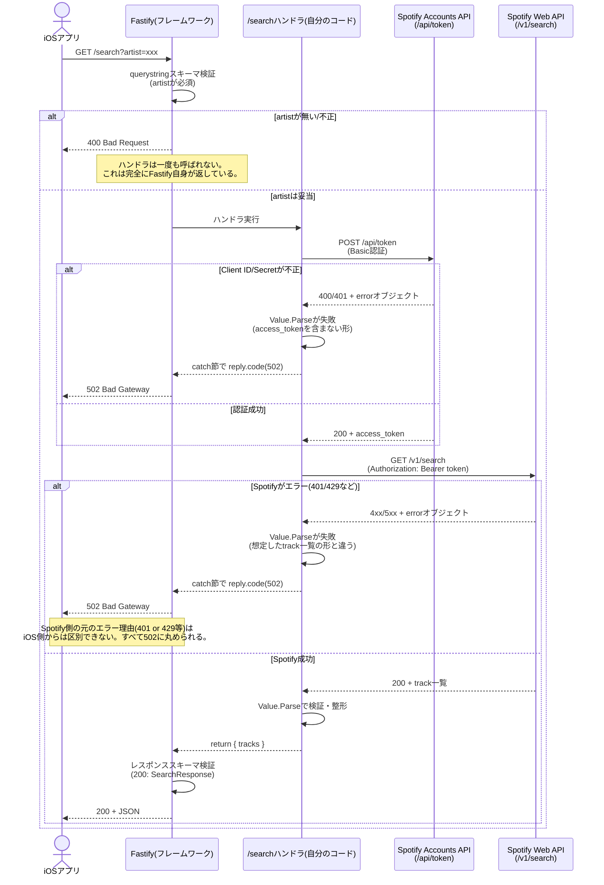

# `GET /search` のエラーフロー

iOSアプリからのリクエストが、どの層を通り、誰がエラーを判定・返却しているかを整理する。

## 誰が何を判定しているか

| ステータス | 判定の主体 | 判定内容 |
|---|---|---|
| `400` | **Fastify自身** | リクエストのクエリパラメータがスキーマ通りか(ハンドラに到達する前) |
| `502` | **自分のハンドラコード** | Spotifyから受け取った値が `Value.Parse` の期待する形と一致するか |
| `200` | **Fastify + 自分のハンドラコード** | ハンドラが返した値が、宣言したレスポンススキーマ通りか(送信前の最終チェック) |

## 現状の既知の穴

- Spotify側の401(認証切れ)、429(レート制限)、トークン取得失敗は、どれも「Value.Parseの失敗」として同じ502に丸められており、iOS側で原因を区別できない。原因ごとに別のステータス/メッセージを返すのは、必要になった時点での改善対象とする。
